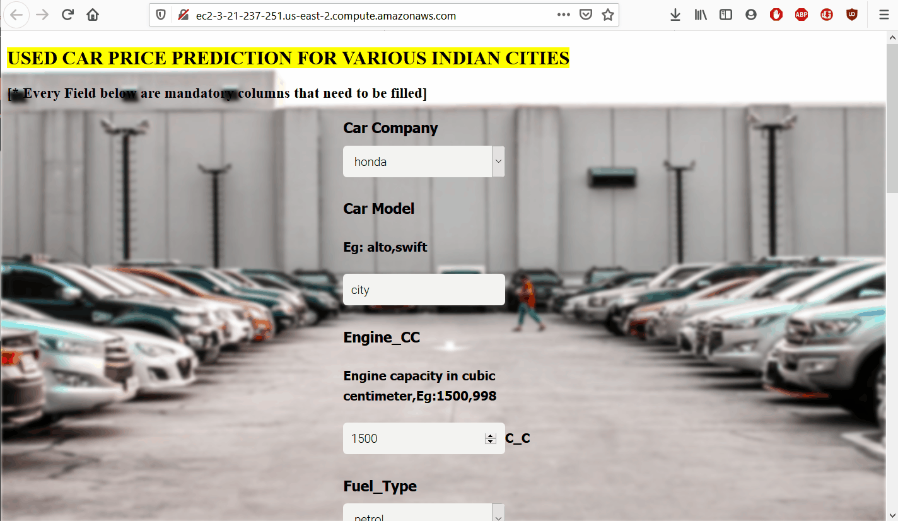

# Project :
## usedCarPricePrediction

This is a Machine Leraning Project based on advanced regression techniques to predict the used car price in the major indian cities.
The project was developed as follows

**1.Built the model after a sophisticated exloratory data analysis and data cleaning**
**2.Write a python Flask sever which will uses the saved model to serve http requests **
**3.Built website in html,css,and javascript where user can input the necessary information regarding vehicle model for price prediction**
**4.Deploy this app to cloud (AWS EC2)**

During the model building we covered almost all data science concepts,tools which are used are
   1. Python
   2.Numpy and Pandas for data cleaning
   3.Matplotlib for data visualization
   4.Sklearn for model building
   5.Boosting techniques
   6.Jupyter notebook, visual studio code as IDE
   7.Python flask for http server
   8. HTML/CSS/Javascript for UI

## The web app is deployed as

http://ec2-3-21-237-251.us-east-2.compute.amazonaws.com/

